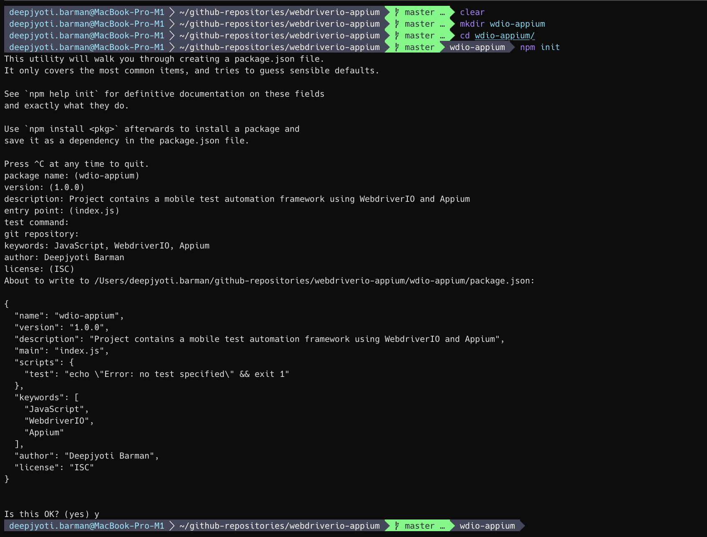
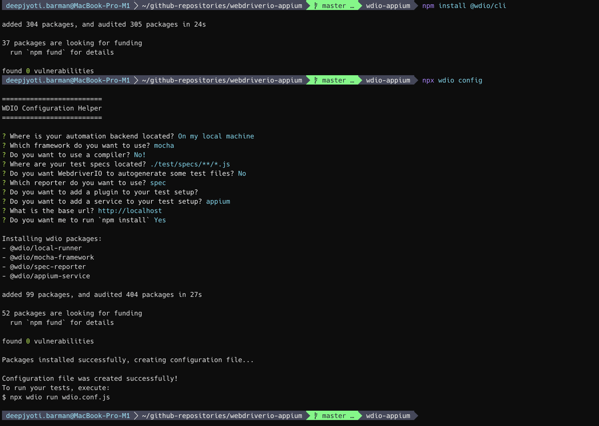

# WebdriverIO Appium Notebook

## What is Appium and why it is so popular

- Appium is an open source testing framework for automating Native, Mobile and Hybrid applications which works on iOS mobile, Android mobile and Windows desktop platforms.
- It is cross-platform compatible. That means, it allows you to write test against multiple platforms iOS, Android and Windows using the same API.
- It uses vendor provided frameworks. That means, for iOS Appium will be using XCUITest, UiAutomation or Instruments, for Android Appium will be using UiAutomator2, Espresso, or UiAutomator1 and for Windows Appium will be using WinAppDriver under the hood. These automation frameworks are provided by vendor itself (i.e. XCUITest is an automation framework from iOS etc.).
- It wraps vendor provided frameworks into WebDriver API. it uses the same client server architecture and it simply extends the existing protocol by adding some API methods for mobile automation.
- Appium client supports popular programming languages like Java, Python, Ruby, JavaScript, C# etc.
- Free to use any test runner and test framework. So, in our case we will be using JavaScript as a language, MOCA as a test runner and WebdriverIO as a test automation framework.

## What is WebdriverIO and why it is so popular

- WebdriverIO is an JavaScript end-to-end automation framework that lets you automation modern web applications (built in Angular, React, Vue and so on) in different browsers and operating system.
- It also supports automating mobile applications in iOS and Android using the help of Appium package.
- WebdriverIO is used by major companies such as Google, Netflix, Microsoft, Mozilla etc.
- It is easy to get started
- It provides easy readable code
- WebdriverIO is also frontend friendly so you can get some help on writing tests from your developers.
- It has a huge community support and actively maintained.
- WebdriverIO is open source, so it can be used by startups to enterprise for free of cost.

## Appium Server Support

| Platform      | Driver        | Platform Versions | Appium Version | Driver Version |
| ------------- | ------------- | ----------------- | -------------- | -------------- |
| iOS           | XCUITest      | 9.3+              | 1.6.0+         | All            |
|               | UIAutomation  | 8.0 to 9.3        | All            | All            |
| Android       | Espresso      | ?+                | 1.9.0+         | All            |
|               | UiAutomator2  | 1.6.0+            | All            |                |
|               | UiAutomator   | 4.3+              | All            | All            |
| Mac           | Mac           | ?+                | 1.6.4+         | All            |
| Windows       | Windows       | 10+               | 1.6.0+         | All            |

## Installation Requirements

- Node.js (Node v16 or less, Node v17 is not compatible with WebdriverIO and Appium)
- Java Development Kit
- Android Studio with Android Emulator
- XCode with iOS Simulator
- Appium Server (install via `npm install -g appium`)
- Appium Inspector (`Remote Port`: Update port to `4724` and run the Appium on the same port as well by doing `appium -p 4724`, `Remote Path`: Set the path to `/wd/hub/` instead of `/`)
- Appium Doctor (install via `npm install -g appium-doctor` and run `appium-doctor --android` / `appium-doctor --ios` to check the whether all the setup and configurations has been done properly before proceeding for writing tests).  
- __Note__: If you are using Appium v2 then you need to install drivers using the commands `appium driver install xcuitest` (for iOS) and `appium driver install uiautomator2` (for Android). To verify if it has been installed, you can run `appium driver list`.

## Environment path configurations (.zshenv/.bashenv)

```bash
export ANDROID_HOME=/Users/deepjyoti.barman/Library/Android/sdk
export JAVA_HOME=/Library/Java/JavaVirtualMachines/jdk1.8.0_301.jdk/Contents/Home
export JAVA11_HOME=/Library/Java/JavaVirtualMachines/jdk-11.0.11.jdk/Contents/Home

export PATH=$PATH:$ANDROID_HOME/emulator
export PATH=$PATH:$ANDROID_HOME/platform-tools
export PATH=$PATH:$ANDROID_HOME/tools
export PATH=$PATH:$ANDROID_HOME/tools/bin
export PATH=$PATH:$JAVA_HOME/bin
```

## WebdriverIO setup




## WebdriverIO configuration (wdio.conf.js)

- Install appium package on your project via `npm install appium`.
- `port: 4723`, this is the port by default where the Appium server is going to run.
- `specs: ['./test/specs/**/*.js'], this is where all of our tests will locate.
- `exclude: []`, if you want to exclude some tests then you can add them over here.
- `maxInstances: 10`, this is helpful for parallelization.
- `capabilities: [{ }]`, we need to specify all our Android / iOS configuration here and remove all capabilities given by default related to web automation.
- `loglevel: 'info'`, log level is the default WebdriverIO log which it will generate when we will be running our test.
- `baseUrl: 'http://localhost'`, we can ignore it as we will be running it on Appium.
- We can configure some timeouts using `waitforTimeout`, `connectionRetryTimeout` etc. keys.
- `services: ['appium']`, the service we have installed during WebdriverIO installation.
- `framework: 'mocha'`, this is the framework we are going to be using for writing our tests.
- At the bottom we also got some hooks options.

    ```javascript
    // Source filename: wdio.conf.js
    const path = require('path');

    exports.config = {
        //
        // ====================
        // Runner Configuration
        // ====================
        //
        port: 4723,
        //
        // ==================
        // Specify Test Files
        // ==================
        // Define which test specs should run. The pattern is relative to the directory
        // from which `wdio` was called.
        //
        // The specs are defined as an array of spec files (optionally using wildcards
        // that will be expanded). The test for each spec file will be run in a separate
        // worker process. In order to have a group of spec files run in the same worker
        // process simply enclose them in an array within the specs array.
        //
        // If you are calling `wdio` from an NPM script (see https://docs.npmjs.com/cli/run-script),
        // then the current working directory is where your `package.json` resides, so `wdio`
        // will be called from there.
        //
        specs: [
            './test/specs/**/*.js'
        ],
        // Patterns to exclude.
        exclude: [
            // 'path/to/excluded/files'
        ],
        //
        // ============
        // Capabilities
        // ============
        // Define your capabilities here. WebdriverIO can run multiple capabilities at the same
        // time. Depending on the number of capabilities, WebdriverIO launches several test
        // sessions. Within your capabilities you can overwrite the spec and exclude options in
        // order to group specific specs to a specific capability.
        //
        // First, you can define how many instances should be started at the same time. Let's
        // say you have 3 different capabilities (Chrome, Firefox, and Safari) and you have
        // set maxInstances to 1; wdio will spawn 3 processes. Therefore, if you have 10 spec
        // files and you set maxInstances to 10, all spec files will get tested at the same time
        // and 30 processes will get spawned. The property handles how many capabilities
        // from the same test should run tests.
        //
        maxInstances: 10,
        //
        // If you have trouble getting all important capabilities together, check out the
        // Sauce Labs platform configurator - a great tool to configure your capabilities:
        // https://saucelabs.com/platform/platform-configurator
        //
        capabilities: [{
            "platformName": "Android",
            "appium:platformVersion": "12.0",
            "appium:udid": "emulator-5554",
            "appium:deviceName": "Pixel 4",
            "appium:automationName": "UiAutomator2",
            // "appium:app": path.join(process.cwd(), "./app/android/MakeMyTrip-8.7.7-standard-release.apk"),
            "appium:appPackage": "com.makemytrip",
            "appium:appActivity": "com.mmt.travel.app.home.ui.SplashActivity",
            // "appium:noReset": true,
            "appium:autoGrantPermissions": true

            // maxInstances can get overwritten per capability. So if you have an in-house Selenium
            // grid with only 5 firefox instances available you can make sure that not more than
            // 5 instances get started at a time.
            
            // If outputDir is provided WebdriverIO can capture driver session logs
            // it is possible to configure which logTypes to include/exclude.
            // excludeDriverLogs: ['*'], // pass '*' to exclude all driver session logs
            // excludeDriverLogs: ['bugreport', 'server'],

            // maxInstances: 5,
            // browserName: 'chrome',
            // acceptInsecureCerts: true
        }],
        //
        // ===================
        // Test Configurations
        // ===================
        // Define all options that are relevant for the WebdriverIO instance here
        //
        // Level of logging verbosity: trace | debug | info | warn | error | silent
        logLevel: 'info',
        //
        // Set specific log levels per logger
        // loggers:
        // - webdriver, webdriverio
        // - @wdio/browserstack-service, @wdio/devtools-service, @wdio/sauce-service
        // - @wdio/mocha-framework, @wdio/jasmine-framework
        // - @wdio/local-runner
        // - @wdio/sumologic-reporter
        // - @wdio/cli, @wdio/config, @wdio/utils
        // Level of logging verbosity: trace | debug | info | warn | error | silent
        // logLevels: {
        //     webdriver: 'info',
        //     '@wdio/appium-service': 'info'
        // },
        //
        // If you only want to run your tests until a specific amount of tests have failed use
        // bail (default is 0 - don't bail, run all tests).
        bail: 0,
        //
        // Set a base URL in order to shorten url command calls. If your `url` parameter starts
        // with `/`, the base url gets prepended, not including the path portion of your baseUrl.
        // If your `url` parameter starts without a scheme or `/` (like `some/path`), the base url
        // gets prepended directly.
        baseUrl: 'http://localhost',
        //
        // Default timeout for all waitFor* commands.
        waitforTimeout: 10000,
        //
        // Default timeout in milliseconds for request
        // if browser driver or grid doesn't send response
        connectionRetryTimeout: 120000,
        //
        // Default request retries count
        connectionRetryCount: 3,
        //
        // Test runner services
        // Services take over a specific job you don't want to take care of. They enhance
        // your test setup with almost no effort. Unlike plugins, they don't add new
        // commands. Instead, they hook themselves up into the test process.
        services: ['appium'],
        
        // Framework you want to run your specs with.
        // The following are supported: Mocha, Jasmine, and Cucumber
        // see also: https://webdriver.io/docs/frameworks
        //
        // Make sure you have the wdio adapter package for the specific framework installed
        // before running any tests.
        framework: 'mocha',
        //
        // The number of times to retry the entire specfile when it fails as a whole
        // specFileRetries: 1,
        //
        // Delay in seconds between the spec file retry attempts
        // specFileRetriesDelay: 0,
        //
        // Whether or not retried specfiles should be retried immediately or deferred to the end of the queue
        // specFileRetriesDeferred: false,
        //
        // Test reporter for stdout.
        // The only one supported by default is 'dot'
        // see also: https://webdriver.io/docs/dot-reporter
        reporters: ['spec'],


        
        //
        // Options to be passed to Mocha.
        // See the full list at http://mochajs.org/
        mochaOpts: {
            ui: 'bdd',
            timeout: 60000
        },
        //
        // =====
        // Hooks
        // =====
        // WebdriverIO provides several hooks you can use to interfere with the test process in order to enhance
        // it and to build services around it. You can either apply a single function or an array of
        // methods to it. If one of them returns with a promise, WebdriverIO will wait until that promise got
        // resolved to continue.
        /**
         * Gets executed once before all workers get launched.
         * @param {Object} config wdio configuration object
         * @param {Array.<Object>} capabilities list of capabilities details
         */
        // onPrepare: function (config, capabilities) {
        // },
        /**
         * Gets executed before a worker process is spawned and can be used to initialise specific service
         * for that worker as well as modify runtime environments in an async fashion.
         * @param  {String} cid      capability id (e.g 0-0)
         * @param  {[type]} caps     object containing capabilities for session that will be spawn in the worker
         * @param  {[type]} specs    specs to be run in the worker process
         * @param  {[type]} args     object that will be merged with the main configuration once worker is initialized
         * @param  {[type]} execArgv list of string arguments passed to the worker process
         */
        // onWorkerStart: function (cid, caps, specs, args, execArgv) {
        // },
        /**
         * Gets executed just after a worker process has exited.
         * @param  {String} cid      capability id (e.g 0-0)
         * @param  {Number} exitCode 0 - success, 1 - fail
         * @param  {[type]} specs    specs to be run in the worker process
         * @param  {Number} retries  number of retries used
         */
        // onWorkerEnd: function (cid, exitCode, specs, retries) {
        // },
        /**
         * Gets executed just before initialising the webdriver session and test framework. It allows you
         * to manipulate configurations depending on the capability or spec.
         * @param {Object} config wdio configuration object
         * @param {Array.<Object>} capabilities list of capabilities details
         * @param {Array.<String>} specs List of spec file paths that are to be run
         * @param {String} cid worker id (e.g. 0-0)
         */
        // beforeSession: function (config, capabilities, specs, cid) {
        // },
        /**
         * Gets executed before test execution begins. At this point you can access to all global
         * variables like `browser`. It is the perfect place to define custom commands.
         * @param {Array.<Object>} capabilities list of capabilities details
         * @param {Array.<String>} specs        List of spec file paths that are to be run
         * @param {Object}         browser      instance of created browser/device session
         */
        // before: function (capabilities, specs) {
        // },
        /**
         * Runs before a WebdriverIO command gets executed.
         * @param {String} commandName hook command name
         * @param {Array} args arguments that command would receive
         */
        // beforeCommand: function (commandName, args) {
        // },
        /**
         * Hook that gets executed before the suite starts
         * @param {Object} suite suite details
         */
        // beforeSuite: function (suite) {
        // },
        /**
         * Function to be executed before a test (in Mocha/Jasmine) starts.
         */
        // beforeTest: function (test, context) {
        // },
        /**
         * Hook that gets executed _before_ a hook within the suite starts (e.g. runs before calling
         * beforeEach in Mocha)
         */
        // beforeHook: function (test, context) {
        // },
        /**
         * Hook that gets executed _after_ a hook within the suite starts (e.g. runs after calling
         * afterEach in Mocha)
         */
        // afterHook: function (test, context, { error, result, duration, passed, retries }) {
        // },
        /**
         * Function to be executed after a test (in Mocha/Jasmine only)
         * @param {Object}  test             test object
         * @param {Object}  context          scope object the test was executed with
         * @param {Error}   result.error     error object in case the test fails, otherwise `undefined`
         * @param {Any}     result.result    return object of test function
         * @param {Number}  result.duration  duration of test
         * @param {Boolean} result.passed    true if test has passed, otherwise false
         * @param {Object}  result.retries   informations to spec related retries, e.g. `{ attempts: 0, limit: 0 }`
         */
        // afterTest: function(test, context, { error, result, duration, passed, retries }) {
        // },


        /**
         * Hook that gets executed after the suite has ended
         * @param {Object} suite suite details
         */
        // afterSuite: function (suite) {
        // },
        /**
         * Runs after a WebdriverIO command gets executed
         * @param {String} commandName hook command name
         * @param {Array} args arguments that command would receive
         * @param {Number} result 0 - command success, 1 - command error
         * @param {Object} error error object if any
         */
        // afterCommand: function (commandName, args, result, error) {
        // },
        /**
         * Gets executed after all tests are done. You still have access to all global variables from
         * the test.
         * @param {Number} result 0 - test pass, 1 - test fail
         * @param {Array.<Object>} capabilities list of capabilities details
         * @param {Array.<String>} specs List of spec file paths that ran
         */
        // after: function (result, capabilities, specs) {
        // },
        /**
         * Gets executed right after terminating the webdriver session.
         * @param {Object} config wdio configuration object
         * @param {Array.<Object>} capabilities list of capabilities details
         * @param {Array.<String>} specs List of spec file paths that ran
         */
        // afterSession: function (config, capabilities, specs) {
        // },
        /**
         * Gets executed after all workers got shut down and the process is about to exit. An error
         * thrown in the onComplete hook will result in the test run failing.
         * @param {Object} exitCode 0 - success, 1 - fail
         * @param {Object} config wdio configuration object
         * @param {Array.<Object>} capabilities list of capabilities details
         * @param {<Object>} results object containing test results
         */
        // onComplete: function(exitCode, config, capabilities, results) {
        // },
        /**
        * Gets executed when a refresh happens.
        * @param {String} oldSessionId session ID of the old session
        * @param {String} newSessionId session ID of the new session
        */
        // onReload: function(oldSessionId, newSessionId) {
        // }
    }
    ```
